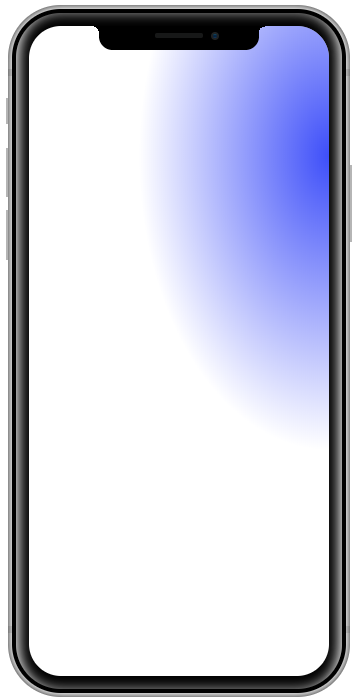

# Device-ui

Forked Project from [marvelapp/devices.css](https://github.com/marvelapp/devices.css) for improving and maintaining

---

## Example

### iPhone X

</img>

```html
<div class="device iphone-x">
  <div class="notch">
    <div class="camera"></div>
    <div class="speaker"></div>
  </div>
  <div class="top-bar"></div>
  <div class="sleep"></div>
  <div class="bottom-bar"></div>
  <div class="volume"></div>
  <div class="inner-shadow"></div>
  <div class="screen"></div>
</div>

<style>
  .iphone-x .screen:before {
    content: "";
    width: 140%;
    height: 100%;
    position: absolute;
    top: -30%;
    right: -70%;
    background: radial-gradient(
      ellipse at center,
      #3e4ff9 0%,
      rgba(62, 79, 249, 0) 64%
    );
  }
</style>
```
